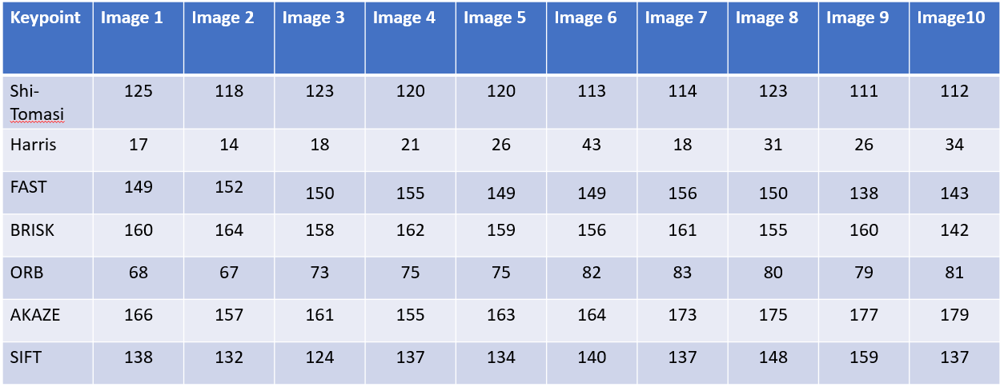

# SFND 2D Feature Tracking: Project Report

This repo contains the Feature Tracking project of the Sensor Fusion Udacity Course.

## Basic Build Instructions

1. Clone this repo.
2. Make a build directory in the top level directory: `mkdir build && cd build`
3. Compile: `cmake .. && make`
4. Run it: `./2D_feature_tracking keypointType descriptorType`. Where keypointType can be any of SHITOMASI, HARRIS, FAST, BRISK, ORB, AKAZE, and SIFT. descriptorType can be of types BRISK, BRIEF, ORB, FREAK, AKAZE and SIFT.

## Project Details

The required rubrics and how they are addressed are discussed below.

### MP.1 Data Buffer Optimization

A Deque datatype is used to achieve the required feature. The size of the deque is checked before an image is added. In case the deque is at its maximum size, the oldest image is popped out from the front while the latest image is pushed_back into the deque. 

### MP.2 Keypoint Detection

The command line argument `keypointType` allows the user to select a keypoint detection method. Supported methods include HARRIS, FAST, BRISK, ORB, AKAZE, SIFT, SHITOMASI. SHITOMASI and HARRIS have been implemented using the tutorial code. The remaining keypoints are implemented in the `detKeypointsModern()`.

### MP.3 Keypoint Removal

All the keypoints are compared to our `rect` of interest. The `contains()` method is used to check if a keypoint lies inside the rect object. If it doesn't, it is removed using `erase()`.

### MP.4 Keypoint Descriptors

Various keypoint descriptors have been implemented in the `descKeypoints()`. These include BRISK, BRIEF, ORB, FREAK, AKAZE and SIFT. This can be chosen from the command line input `descriptorType`.

### MP.5 Descriptor Matching

The `matchDescriptor()` function takes in parameters `matcherType` and `selectorType`. matcherType can be either `MAT_BF` (Brute Force) or `MAT_FLANN`. Similarly selectorType can be `SEL_NN` or `SEL_KNN`. At the moment, all the descriptors use KNN based selection and Brute Force based matching (except for SIFT - which uses FLANN). This can be changed by changing the value of these strings in `main()` and rebuilding the project.

### MP.6 Descriptor Distance Ratio

The `matchDescriptor()` function implements a distance ratio check when KNN is chosen as `selectorType`. This has been fixed to 0.8 as per requirements but can be modified.

### MP.7 Performance Evaluation 1

The number of keypoints detected in the given region of interest for each keypoint type is shown in the table below. 

### MP.8 Performance Evaluation 2

The total number of matched keypoints for all keypoint types is shown in Table 2 below. Here TM stands for Total Matches.

### MP.9 Performance Evaluation 3

The average keypoint detection time over 10 images (KD time) and average descriptor extraction time over 10 images (DE time) are mentioned in Table 2. Note: AKAZE descriptor only works with AKAZE keypoints. Also, SIFT detector with ORB descriptor seems to throw an error.

From these observations, TOP 3 pairs based on detection time would be:
- FAST detector with BRIEF descriptor
- FAST detector with BRISK descriptor
- FAST detector with ORB descriptor

Note: The detection time depends on some parameters passed into the function. For example, FAST detector takes arguments for threshold, Non-max-supression and type. These may affect the detection time. Similar also applies for other detectors and descriptors. 

